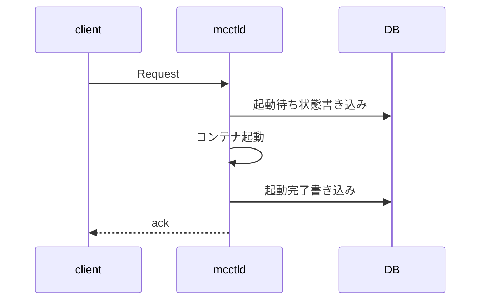

# アーキテクチャ

```mermaid
sequenceDiagram
  client ->> mcctld: Request
  mcctld ->> DB: 起動待ち状態書き込み
  mcctld ->> mcctld: コンテナ起動
  mcctld ->> DB: 起動完了書き込み
  mcctld -->> client: ack
```
別にDBはRDBじゃなくてもいい。ファイルでもD1でも、それこそetcdでもいい。
